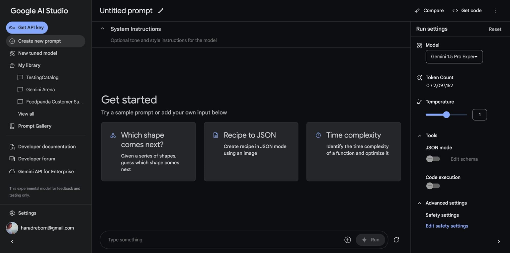
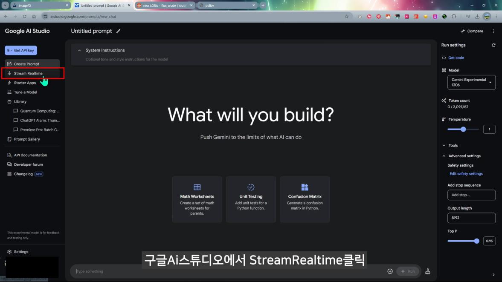

# 4차시: Google AI Studio 기능 소개 & Gemini 멀티모달 데이터 분석 실습

## 14일차 | 4교시 (60분)

---

## 🎯 학습 목표

> 이 수업을 마치면 다음을 할 수 있음:
> 1. Google AI Studio의 **3가지 핵심 인터페이스**(Playground, Build, Gallery)를 이해하고 접속할 수 있다
> 2. Run Settings의 주요 설정 항목을 조절하여 **원하는 방식으로 AI 응답**을 받을 수 있다
> 3. Gemini의 멀티모달 기능을 활용하여 **PDF, 영상, 이미지에서 데이터를 추출**할 수 있다
> 4. 분양 기획 업무에 멀티모달 분석을 **실무 적용**할 수 있다

---

## 📋 목차

| 시간 | 섹션 | 내용 |
|------|------|------|
| 5분 | 1. 도입 | Google AI Studio란? |
| 12분 | 2. UI 소개 & 핵심 기능 | Playground, Build, Gallery + Run Settings |
| 8분 | 3. 멀티모달 기능 개요 | Gemini가 처리할 수 있는 데이터 유형 |
| 10분 | 4. [시연] PDF 분석 & 차트 시각화 | 분양 공고문 PDF → 핵심 정보 추출 → 차트 |
| 10분 | 5. [시연] 영상 분석 | 분양 홍보 영상 → 대본 추출 & 벤치마킹 |
| 8분 | 6. [시연] 웹페이지 데이터 추출 | 스크린샷 → 구조화 데이터(JSON) |
| 5분 | 7. Live 기능 & 주의사항 | 화면 공유, 데이터 보안, 환각 주의 |
| 2분 | 8. 정리 & 다음 차시 예고 | 핵심 요약, 5차시 안내 |

---

# 1. 📌 도입 — Google AI Studio란? (5분)

## 왜 Google AI Studio인가?

1~3차시에서 Perplexity, NotebookLM, Gemini, Gem 등 다양한 AI 도구를 학습함. 이번 시간에는 이 모든 도구의 **기반이 되는 플랫폼** — **Google AI Studio**를 직접 사용해봄

```
"경쟁 단지 홍보 영상을 분석해서 우리 전략에 반영하고 싶은데..."
"분양 공고문 PDF가 50페이지인데, 핵심만 빠르게 뽑아야 하는데..."
"부동산114 사이트에서 분양 데이터를 정리해야 하는데..."
```

이런 업무들을 **텍스트뿐 아니라 영상·PDF·이미지까지 한 번에 분석**할 수 있는 곳이 바로 Google AI Studio

### ⚡ Google AI Studio의 핵심 포지션

| 구분 | Gemini 앱 (gemini.google.com) | Google AI Studio (aistudio.google.com) |
|------|------|------|
| **성격** | 일반 사용자용 대화형 AI | 개발자/파워유저용 실험 플랫폼 |
| **모델 선택** | 제한적 | **최신 모델 즉시 사용** 가능 |
| **세부 설정** | 제한적 | Temperature, 토큰 수 등 **세밀 조절** |
| **멀티모달** | 기본 지원 | **파일 업로드, 영상 분석, 코드 실행** 등 풀 기능 |
| **Build 기능** | ❌ | ✅ 코딩 없이 앱 만들기 |
| **비용** | Advanced 유료 구독 | **무료** (구글 계정만 있으면 됨) |

> 💡 Google AI Studio는 Gemini의 **모든 기능을 무료로 실험**해볼 수 있는 플랫폼. 분양 기획자에게는 특히 **멀티모달 데이터 분석**(PDF, 영상, 이미지)이 강력한 무기가 됨

🔗 **접속**: [aistudio.google.com](https://aistudio.google.com) (구글 계정으로 로그인)

---

# 2. 🖥️ Google AI Studio UI 소개 & 핵심 기능 (12분)

## 2-1. 화면 구성 한눈에 보기


Google AI Studio에 접속하면 크게 **3개 영역**으로 구분됨:

| 영역 | 위치 | 설명 |
|------|------|------|
| ❶ **왼쪽 사이드바** | 좌측 | 메뉴 탐색: Create Prompt, Stream Realtime, Build, Library, Prompt Gallery 등 |
| ❷ **중앙 작업 영역** | 가운데 | System Instructions 입력 + 대화/파일 업로드 공간 |
| ❸ **오른쪽 설정 패널** | 우측 | Run Settings: 모델 선택, Temperature, 토큰 수, 도구 설정 등 |

---

## 2-2. 3가지 핵심 인터페이스

### 🔧 Playground (플레이그라운드)



AI와 직접 대화하는 **기본 작업 공간**

- 텍스트 프롬프트 입력 + **파일 업로드** (PDF, 이미지, 영상, 오디오)
- System Instructions에 **역할·톤·지침**을 설정해두면 일관된 답변 가능
- 실시간으로 결과를 확인하며 프롬프트 개선

> 💡 3차시에서 배운 **Gem**(맞춤형 AI)의 System Instructions와 같은 개념. Google AI Studio에서는 더 세밀하게 설정 가능

### 🏗️ Build (빌드)

코딩 없이 **자연어로 웹 앱을 만드는** 기능. "바이브 코딩(Vibe Coding)"이라고도 부름

```
예시 프롬프트:
"분양 단지별 분양가 비교 차트를 만들어줘.
 사용자가 지역과 평형을 선택하면 비교 결과가 나오는 웹앱으로."
```

- 프롬프트 입력 → AI가 코드 생성 → **즉시 실행 가능한 앱** 완성
- HTML/CSS/JavaScript를 몰라도 OK
- 6차시에서 Build 기능을 본격적으로 실습 예정

### 🖼️ Gallery (갤러리)

- 다른 사용자들이 만든 **AI 앱 예시**를 둘러볼 수 있는 공간
- 프롬프트 구조와 앱 구성을 **벤치마킹**하기 좋음
- 마음에 드는 앱을 복제해서 내 것으로 수정 가능

---

## 2-3. ⚙️ Run Settings — AI 응답 조절하기

오른쪽 패널의 **Run Settings**에서 AI의 동작 방식을 세밀하게 제어 가능

| 설정 항목 | 설명 | 분양 기획자 활용 팁 |
|-----------|------|-------------------|
| **Model** | 사용할 Gemini 모델 선택 | 최신 모델(Gemini 2.5 Pro 등) 선택 권장 |
| **Temperature** | 응답의 창의성 조절 (0~2) | 데이터 분석 = 낮게(0.2~0.5), 아이디어 = 높게(0.8~1.2) |
| **Grounding with Google Search** | 실시간 웹 검색 연동 | 최신 분양 데이터 확인 시 ON |
| **URL Context** | 특정 URL의 내용을 참고 | 경쟁 단지 홈페이지 URL 입력 |
| **Code Execution** | AI가 생성한 코드를 실행 | 차트·그래프 자동 생성 시 ON |
| **Structured Output** | JSON 형식으로 응답 | 데이터 정리·추출 시 활용 |

> 🎓 **수강생 체크포인트**: Temperature를 0.2로 설정하면 데이터 분석에 적합한 정확한 답변, 1.0으로 설정하면 창의적인 마케팅 아이디어를 얻을 수 있음

---

# 3. 🌐 Gemini 멀티모달 기능 개요 (8분)

## 멀티모달(Multimodal)이란?

**멀티모달** = 여러 종류(모드)의 데이터를 동시에 처리하는 능력

```
텍스트 📝 + 이미지 🖼️ + 영상 🎬 + 오디오 🔊 + PDF 📄
                    ↓
            Gemini가 한 번에 이해하고 분석
                    ↓
        구조화된 답변 (표, 차트, JSON, 보고서)
```

### 📊 Gemini가 처리할 수 있는 데이터 유형

| 데이터 유형 | 지원 형식 | 분양 기획 활용 예시 |
|------------|----------|-------------------|
| **텍스트** | 일반 텍스트, 마크다운 | 기획서 초안, 보고서 작성 |
| **이미지** | JPG, PNG, GIF, WebP | 도면 분석, 경쟁사 광고 분석 |
| **PDF** | 1,000페이지 이상 처리 가능 | 분양 공고문, 시장 보고서 분석 |
| **영상** | 최대 90분 | 홍보 영상 분석, 대본 추출 |
| **오디오** | MP3, WAV 등 | 회의 녹음 요약, 현장 소리 분석 |

### 🏠 분양 기획자를 위한 멀티모달 활용 맵

```
📄 분양 공고문 PDF     →  핵심 조항 추출 + 비교표 생성
🎬 경쟁사 홍보 영상    →  대본 추출 + 스토리라인 분석
🖼️ 부동산 사이트 캡처  →  분양 데이터 JSON 추출
📊 시장 보고서 PDF     →  분기별 추이 차트 자동 생성
🏗️ 설계 도면 이미지    →  면적·세대수 데이터 표로 정리
```

> 💡 지금까지는 텍스트로 질문하고 텍스트로 답을 받았다면, 멀티모달은 **파일을 올리고 "이거 분석해줘"** 라고 말하는 것만으로 결과를 얻을 수 있음

---

# 4. 🖥️ [시연] PDF 분석 & 차트 시각화 (10분)

## 시연 목적

> 💡 수십~수백 페이지의 PDF 문서를 Gemini에 올려서 **핵심 정보를 자동 추출**하고, **차트로 시각화**하는 과정을 시연

## 4-1. 분양 공고문 PDF에서 핵심 정보 추출

### 📝 시연 시나리오

```
[상황]
50페이지짜리 분양 공고문 PDF를 받음.
여기서 분양가, 입주 예정일, 계약 조건, 세대 구성 등
핵심 정보만 빠르게 뽑아야 하는 상황
```

### 🖥️ [시연] 실습 순서

1. **Google AI Studio 접속** → [aistudio.google.com](https://aistudio.google.com)
2. **PDF 파일 업로드** → 대화창 하단의 📎 아이콘 클릭 → 분양 공고문 PDF 선택
3. **프롬프트 입력**:

```
이 분양 공고문에서 다음 항목을 추출해서 표로 정리해줘:

1. 단지명 및 위치
2. 총 세대수 및 타입별 세대 구성
3. 분양가 (타입별)
4. 입주 예정일
5. 계약 조건 (계약금, 중도금, 잔금 비율)
6. 특별공급 유형 및 세대수
7. 주요 편의시설 및 교통 접근성

각 항목의 근거가 되는 페이지 번호도 함께 표시해줘.
```

4. **결과 확인** → Gemini가 PDF 내용을 분석하여 구조화된 표로 정리

### ✅ 시연 포인트

| 기존 방식 | Google AI Studio |
|-----------|-----------------|
| 50페이지 PDF를 처음부터 끝까지 읽기 | **파일 업로드 + 프롬프트 한 줄** |
| 핵심 정보를 수작업으로 엑셀에 정리 | **자동으로 표 생성** |
| 소요 시간: 1~2시간 | **소요 시간: 1~2분** |

---

## 4-2. 시장 보고서 PDF → 차트 자동 생성

### 📝 시연 시나리오

```
[상황]
한국부동산원의 분기별 분양 실적 보고서 PDF를 분석해서
분양률 추이 차트를 만들어야 함
```

### 🖥️ [시연] 프롬프트

```
이 보고서에서 분기별 분양 실적 데이터를 추출하고,
다음 차트를 Python matplotlib 코드로 생성해줘:

1. 분기별 분양 물량 막대 차트
2. 분양률(%) 추이 라인 차트
3. 지역별(서울/경기/인천) 분양 물량 비교 차트

차트는 한글 폰트를 적용하고, 색상은 비즈니스 프레젠테이션에
적합한 톤으로 설정해줘.
```

> ⚙️ **Run Settings 팁**: 이 시연에서는 **Code Execution**을 ON으로 설정하면 Gemini가 생성한 Python 코드를 **바로 실행**해서 차트 이미지를 보여줌

### 💡 활용 확장

- 분양 공고문 여러 개를 올려서 **단지 간 비교표** 자동 생성
- 경쟁사 제안서 PDF를 올려서 **강점/약점 분석** 요청
- 법규 문서 PDF를 올려서 **해당 조항 요약 + 실무 적용 방안** 도출

---

# 5. 🖥️ [시연] 영상 분석 — 대본 추출 & 벤치마킹 (10분)

## 시연 목적

> 💡 경쟁 단지의 홍보 영상을 Gemini에 올려서 **대본을 자동 추출**하고, **스토리라인 프레임워크**를 분석하는 과정을 시연

### 📝 시연 시나리오

```
[상황]
경쟁 단지의 3분짜리 분양 홍보 영상이 있음.
이 영상의 스토리 구조를 분석해서 우리 단지 홍보 영상 기획에 참고하고자 함
```

### 🖥️ [시연] 실습 순서

1. **영상 파일 업로드** → 대화창에서 영상 파일(.mp4) 업로드
2. **프롬프트 입력**:

```
이 분양 홍보 영상을 분석해서 다음을 정리해줘:

1. 전체 대본 (타임스탬프 포함)
2. 장면별 상황 묘사 (어떤 공간이 보이는지, 어떤 연출인지)
3. 스토리 구조 분석:
   - 도입부: 어떤 메시지로 시작하는지
   - 전개: 어떤 장점을 어떤 순서로 보여주는지
   - 클라이맥스: 가장 강조하는 포인트
   - 마무리: CTA(Call to Action)는 무엇인지
4. 벤치마킹 포인트 3가지 (우리 단지 홍보에 적용할 수 있는 것)
```

### ✅ 영상 분석 결과 활용법

| 분석 항목 | 활용 방법 |
|-----------|----------|
| **대본 추출** | 우리 영상 대본 작성 시 참고 프레임 |
| **장면 묘사** | 촬영 콘티·스토리보드 기획 |
| **스토리 구조** | 홍보 영상의 **문제-해결-비전** 프레임워크 도출 |
| **벤치마킹 포인트** | 마케팅 전략 회의 자료로 활용 |

### 💡 추가 활용 아이디어

- **현장 방문 영상** 업로드 → 주변 인프라·교통·편의시설 정보 자동 정리
- **모델하우스 투어 영상** → 인테리어 특징·마감재 분석
- **경쟁사 유튜브 광고 여러 개** → 공통 패턴 분석 + 차별화 포인트 도출

> ⚠️ **참고**: Gemini는 현재 **1FPS(초당 1프레임)**으로 영상을 샘플링. 매우 빠르게 지나가는 자막이나 순간적인 장면은 놓칠 수 있으므로, 중요한 내용은 추가 확인 필요

---

# 6. 🖥️ [시연] 웹페이지 데이터 추출 (8분)

## 시연 목적

> 💡 분양 정보 사이트의 **스크린샷을 찍어서** Gemini에 올리면, 데이터를 **JSON이나 표 형태로 자동 정리** 가능

### 📝 시연 시나리오

```
[상황]
부동산114에서 수도권 신규 분양 단지 목록을 확인함.
이 데이터를 정리해서 경쟁 분석표를 만들어야 하는 상황
```

### 🖥️ [시연] 실습 순서

1. **웹사이트 스크린샷 촬영** → 부동산114 또는 청약홈에서 분양 정보 페이지 캡처
2. **이미지 업로드** → Google AI Studio에 스크린샷 이미지 업로드
3. **프롬프트 입력**:

```
이 웹페이지 스크린샷에서 다음 정보를 추출해서
JSON 형식으로 정리해줘:

- 단지명
- 위치 (시/구/동)
- 분양가 (3.3㎡당)
- 총 세대수
- 분양 일정 (청약 접수일, 당첨자 발표일)
- 시공사

추출한 데이터를 분양가 기준 오름차순으로 정렬해줘.
```

### ✅ 결과 활용

```json
[
  {
    "단지명": "○○파크 자이",
    "위치": "경기도 화성시 ○○동",
    "분양가_3.3㎡": "1,850만원",
    "총_세대수": 1247,
    "청약_접수일": "2026-04-15",
    "시공사": "GS건설"
  },
  ...
]
```

추출한 JSON 데이터를 → **엑셀/구글 시트에 붙여넣기** → 경쟁 분석 리포트 완성

### 💡 웹 데이터 추출 활용 확장

| 활용 시나리오 | 방법 |
|--------------|------|
| **경쟁사 홈페이지 분석** | 홈페이지 캡처 → 홍보 메시지·디자인 구조 분석 |
| **부동산 뉴스 정리** | 기사 캡처 여러 장 → 핵심 내용 요약표 생성 |
| **SNS 광고 분석** | 인스타그램·페이스북 광고 캡처 → 카피·비주얼 전략 분석 |

---

# 7. 🔴 Live 기능 & 주의사항 (5분)

## 7-1. 🎥 Live — 실시간 화면 공유



Google AI Studio의 **Stream Realtime** 기능을 사용하면 **PC 화면을 AI와 실시간 공유**하면서 도움을 받을 수 있음

### 활용 예시

```
📊 엑셀에서 분양 데이터를 정리하다가 막히면
   → "이 시트에서 피벗 테이블 어떻게 만들어?"

🖥️ 처음 접하는 소프트웨어를 사용할 때
   → "이 버튼이 뭐하는 건지 설명해줘"

📝 기획서를 작성하면서 실시간 피드백
   → "이 문단 표현이 자연스러운지 봐줘"
```

> 💡 마치 **옆자리 동료**에게 화면을 보여주면서 물어보는 것과 같음

---

## 7-2. ⚠️ 사용 시 주의사항

Google AI Studio는 강력한 도구이지만, 반드시 알아두어야 할 사항이 있음

| 주의사항 | 설명 | 대처법 |
|---------|------|--------|
| 🔒 **데이터 보안** | 입력한 데이터가 모델 훈련에 사용될 수 있음 | **개인정보, 미공개 분양가, 계약 정보** 등 민감 정보 입력 금지 |
| 🤖 **환각(Hallucination)** | AI가 사실이 아닌 내용을 생성할 수 있음 | 추출된 데이터는 **반드시 원본과 대조 검증** |
| 📶 **인터넷 필요** | 웹 기반 서비스로 오프라인 사용 불가 | 현장에서는 모바일 테더링 등 대비 |
| 📏 **파일 크기 제한** | 업로드 파일 크기에 제한 있음 | 대용량 영상은 핵심 부분만 잘라서 업로드 |

> 🛡️ **실무 원칙**: Google AI Studio로 분석한 결과는 **"초안"**으로 활용하고, 최종 보고서에 반영하기 전에 **반드시 사람이 검증**할 것

---

# 8. 📝 정리 & 다음 차시 예고 (2분)

## ✅ 오늘 배운 핵심 정리

| 항목 | 핵심 내용 |
|------|----------|
| **Google AI Studio** | Gemini 모델을 무료로 실험할 수 있는 플랫폼 (Playground / Build / Gallery) |
| **Run Settings** | Temperature, Code Execution, Grounding 등으로 AI 동작 세밀 제어 |
| **PDF 분석** | 수십~수백 페이지 PDF에서 핵심 정보 추출 + 차트 자동 생성 |
| **영상 분석** | 홍보 영상 대본 추출 + 스토리라인 벤치마킹 |
| **웹 데이터 추출** | 스크린샷 → JSON 구조화 데이터 자동 변환 |
| **주의사항** | 민감 정보 입력 금지, AI 결과는 반드시 검증 |

## 🔑 오늘의 한 줄 정리

> **Google AI Studio는 텍스트뿐 아니라 PDF·영상·이미지를 한 번에 분석하는 "올인원 AI 작업실". 분양 기획자에게는 특히 멀티모달 데이터 분석이 리서치 시간을 획기적으로 줄여주는 무기**

## 📢 다음 차시 예고

> 5차시에서는 Google AI Studio의 **이미지 생성 기능**과 **Nano-Banana**를 활용해서 분양 홍보용 비주얼을 직접 만들어봄. 도면을 3D 이미지로 변환하고, 계절별 외관 이미지를 생성하는 실습 진행 예정 🎨

---

## 📎 출처 참조

### 내부 문서
- [[002.강의자료/260116_인프런_교강사/4차시 AI 활용 기획 2 30c77034908f806fbb74f952c1cf6798]] — Google AI Studio 인포그래픽 제작, Nano-banana 소개
- [[002.강의자료/250530_부마협_매력일자리-최신-AI-트렌드-활용-전략/0530_매력일자리_공유용/0530_챗대리_매력일자리교육교안_f]] — Google AI Studio UI 스크린샷, Stream Realtime 소개
- [[002.강의자료/260320_국회김승원의원실_노트북LM_Cowork_Skills_강의/노트북LM 및 클로드 코워크 & 스킬 활용법 32477034908f800eafa1ebd899149bc2]] — Gemini 멀티모달 추론 워크플로우

### 외부 출처
- [Google AI Studio 종합 가이드 — 이랜서 블로그](https://www.elancer.co.kr/blog/detail/1032)
- [Gemini 멀티모달 기능 7가지 예시 — Google Developers Blog](https://developers.googleblog.com/ko/7-examples-of-geminis-multimodal-capabilities-in-action/)
- [Google AI Studio 공식 사이트](https://aistudio.google.com)
