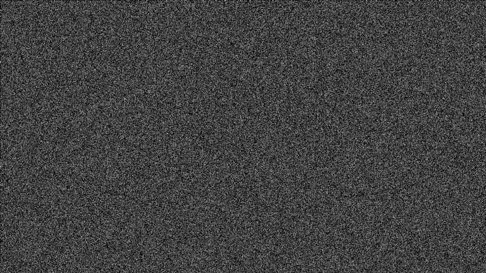
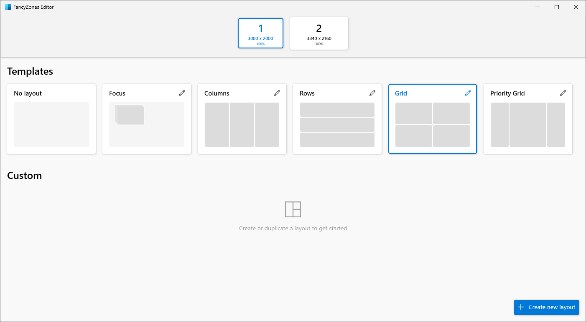

# 5차시: 나노바나나 및 이미지 생성 모델 소개 — 분양 홍보용 비주얼 생성

## 14일차 | 5교시 (60분)

---

## 🎯 학습 목표

> 이 수업을 마치면 다음을 할 수 있음:
> 1. 나노바나나(Gemini 2.5 Flash Image)의 **핵심 기능과 접속 방법**을 설명할 수 있다
> 2. 프롬프트 6요소 공식을 활용해 **원하는 이미지를 편집**할 수 있다
> 3. 평면도·외관 이미지를 **3D 렌더링, 앙투라지 추가, 계절 변경, 인테리어 리모델링, 시점 변경** 등으로 변환할 수 있다
> 4. 나노바나나 편집 이미지를 **Veo 3로 영상으로 변환**하는 워크플로우를 이해할 수 있다

---

## 📋 목차

| 시간 | 섹션 | 내용 |
|------|------|------|
| 3분 | 1. 도입 | 분양 마케팅에서 비주얼의 중요성 |
| 8분 | 2. 나노바나나 소개 | 정식 명칭, 접속법, 핵심 기능 |
| 5분 | 3. 이미지 생성 모델 비교 | 나노바나나 vs ChatGPT vs Flux vs Qwen |
| 4분 | 4. 프롬프트 6요소 공식 | 잘 먹히는 프롬프트 작성법 |
| 20분 | 5. [시연] 분양 홍보용 비주얼 생성 | 도면→3D, 앙투라지, 계절변경, 리모델링, POV |
| 5분 | 6. 이미지 → 비디오 소개 | Veo 3 개념 + 영상 모델 비교 |
| 3분 | 7. [시연] 홍보 영상 만들기 | 나노바나나 이미지 → Veo 3 영상 변환 |
| 7분 | 8. 실습 시간 | 수강생 직접 실습 + Q&A |
| 5분 | 9. 정리 & 다음 차시 예고 | 핵심 요약 + 주의사항 + 6차시 안내 |

---

# 1. 📌 도입 — 분양 마케팅에서 비주얼의 중요성 (3분)

## 분양 기획자의 비주얼 고민

분양 기획자는 다양한 시각 자료를 준비해야 함

```
"평면도를 3D 이미지로 만들어야 하는데 외주 비용이..."
"모델하우스 사진에 사람이나 나무를 추가하고 싶은데..."
"같은 단지를 봄/여름/가을/겨울 버전으로 보여주고 싶은데..."
"홍보 영상을 만들고 싶은데 촬영팀 섭외가..."
```

### ⚡ AI 이미지 생성 도구를 쓰면?

| 기존 방식 | AI 이미지 편집 |
|-----------|---------------|
| 3D 렌더링 외주 → 수일~수주 | 프롬프트 입력 → **1~2분** |
| 포토샵 전문가 필요 | **자연어**로 누구나 편집 |
| 계절별 촬영 → 수개월 | 프롬프트 한 줄로 **즉시 변환** |
| 홍보 영상 촬영 → 수백만원 | 이미지 1장 → **수천원에 영상 생성** |

> 💡 4차시에서 Google AI Studio의 **멀티모달 분석** 기능을 배움. 이번 시간에는 같은 플랫폼에서 **이미지 생성·편집** 기능을 다룸

---

# 2. 🍌 나노바나나(Nano-Banana) 소개 (8분)

## 나노바나나란?



- **정식 명칭**: Gemini 2.5 Flash Image
- 2025년 8월 구글이 공식 발표한 **이미지 편집 모델**
- 자연어 프롬프트만으로 포토샵 수준의 이미지 편집 가능
- 특히 **캐릭터 일관성 유지** 능력이 업계 최고 수준

> 💡 나노바나나는 이미지 **'편집'** 모델임. Gemini에서 새로운 이미지를 '생성'할 때는 **Imagen 3** 모델을 사용

---

## 접속 방법 3가지

| 방법 | URL | 특징 | 추천도 |
|------|-----|------|--------|
| **Google AI Studio** | [aistudio.google.com](https://aistudio.google.com) > Try Nano-Banana | 모델 직접 지정, **무료** | ⭐⭐⭐ |
| **Gemini 앱** | [gemini.google.com](https://gemini.google.com) | 무료 (사용량 제한), 유료 구독 시 확대 | ⭐⭐ |
| **LMArena** | [lmarena.ai](https://lmarena.ai/) | 무료, 랜덤 배정 (모델 지정 불가) | ⭐ |

> 📌 **실습에서는 Google AI Studio를 사용**. 4차시에서 이미 접속해본 플랫폼이므로 익숙할 것

### LMArena 꿀팁 🍯

LMArena는 여러 AI 모델이 섞여 있어 나노바나나가 랜덤으로 등장함. 프롬프트 끝에 **"model: nano banana"**를 붙이면 등장 확률이 높아진다는 팁이 있음

---

## 핵심 기능 5가지


### ① 의상/배경 교체

캐릭터의 외형은 그대로 유지하면서 **의상이나 배경만 변경**


> 인물 사진을 넣고 "이 사람이 공사현장에서 안전모를 쓰고 있는 모습으로 바꿔줘"라고 요청하면 자연스럽게 변환

### ② 사진 합성

여러 장의 이미지를 업로드해 **하나의 새로운 장면**을 만듦

> 분양 현장 사진 + 가족 사진 → "가족이 아파트 앞에서 웃고 있는 장면" 합성

### ③ 디자인 믹싱

한 이미지의 **스타일을 다른 이미지에 적용**

> 유명 건축물의 디자인 스타일을 우리 단지 외관에 입혀보기

### ④ 부분 편집

특정 영역만 수정하고 **나머지는 그대로 유지**

> 거실 사진에서 "소파만 네이비 색으로 바꿔줘" → 소파만 변경, 나머지 동일

### ⑤ 텍스트 안정성

이미지 내 **텍스트가 깨지지 않고** 깔끔하게 처리됨

> 분양 홍보 포스터의 텍스트 색상이나 내용을 변경 가능

---

# 3. 📊 이미지 생성·편집 모델 비교 (5분)

## 주요 이미지 AI 모델 비교

| 모델 | 개발사 | 특징 | 비용 | 추천 용도 |
|------|--------|------|------|----------|
| 🍌 **나노바나나** | 구글 | 이미지 **편집** 최강, 캐릭터 일관성 | 무료 (AI Studio) | 분양 이미지 편집, 3D 변환 |
| 🎨 **Imagen 3** | 구글 | 새 이미지 **생성** | Gemini 앱 내 무료 | 완전히 새로운 이미지 생성 |
| 🤖 **ChatGPT (GPT-4o)** | OpenAI | 텍스트 삽입 안정, 범용 | 유료 구독 ($20/월) | 로고, 텍스트 포함 이미지 |
| 🌊 **Flux** | Black Forest Labs | 오픈소스, 고품질 | 플랫폼별 상이 | 고품질 아트워크 |
| 🐼 **Qwen** | 알리바바 | **한국어** 프롬프트 우수, 무료 | 무료 (하루 5장) | 빠른 테스트 |

> 💡 분양 기획 업무에서는 기존 사진을 **편집**하는 경우가 많으므로, **나노바나나**가 가장 적합. 완전히 새로운 이미지가 필요할 때는 ChatGPT나 Imagen 3 활용

### 🏆 2025년 가장 많이 사용되는 이미지/영상 생성 AI

Artificial Analysis 조사 결과 (개발자·제작자 300명 대상):

- **이미지 모델 TOP 3**: Gemini(나노바나나) > ChatGPT > Flux
- **영상 모델 TOP 3**: Veo 3 > Kling > Hailuo
- 이미지 생성 개인 채택률 **89%** — 이미 대중화된 기술

🔗 [리포트 전문 보기](https://artificialanalysis.ai/media/survey-2025)

---

# 4. ✍️ 프롬프트 6요소 공식 (4분)

## 나노바나나에서 잘 먹히는 프롬프트 작성법

나노바나나를 제대로 활용하려면 **6가지 요소**를 챙겨야 함

| 요소 | 설명 | 분양 기획 예시 |
|------|------|--------------|
| 🎯 **주제 (Subject)** | 누가/무엇이 등장하는지 | "30대 부부가" |
| 📸 **구도 (Composition)** | 클로즈업, 와이드샷 등 | "와이드 앵글로" |
| 📍 **장소 (Location)** | 어디서 일어나는 장면인지 | "아파트 거실에서" |
| 🎨 **스타일 (Style)** | 수채화, 포토리얼 등 | "포토리얼리스틱 스타일로" |
| ✏️ **편집 지시 (Editing)** | 변경 사항을 명확하게 | "벽지를 밝은 크림색으로 변경" |
| 🏃 **행동 (Action)** | 대상의 동작 | "소파에 앉아 대화하고 있다" |

### ⚠️ 프롬프트 작성 주의사항

```
❌ "바닥 우드톤으로 바꿔줘"          → 이미지 생성 실패
✅ "이 사진에서 바닥을 우드톤으로 바꿔줘" → 이미지 생성 성공
```

- **짧고 모호한 표현**보다 **구체적이고 명확한 문장**이 결과가 좋음
- **영어 프롬프트**가 한국어보다 결과물 품질이 높음 → 영어 추천
- 한국어를 쓸 경우 Gemini에 "이 한국어를 영어로 번역해줘" 요청 후 사용하면 편리

### 📌 100가지 프롬프트 예시 참고

나노바나나 활용 사례와 프롬프트가 100개 이상 정리된 GitHub 저장소가 있음

🔗 [Awesome Nano Banana Images (한국어)](https://github.com/PicoTrex/Awesome-Nano-Banana-images/blob/main/README_kr.md)

> 각 사례마다 **어떤 인풋과 프롬프트를 사용했는지 상세하게 공개**되어 있어, 실무에서 바로 응용 가능

---

# 5. 🖥️ [시연] 분양 홍보용 비주얼 생성 (20분)

## 시연 개요

> 💡 Google AI Studio의 나노바나나를 활용해, 분양 기획에서 실제로 쓸 수 있는 **5가지 비주얼 편집**을 시연

### 시연 준비

1. [aistudio.google.com](https://aistudio.google.com) 접속
2. **"Try Nano-Banana"** 클릭 (또는 모델 선택에서 Gemini 2.5 Flash 선택 후 이미지 생성 모드)
3. 시연용 이미지 파일 준비 (평면도, 아파트 외관, 빈 실내 등)

---

## 5-1. 🏗️ 도면 → 3D 렌더링

2D 평면도를 실감나는 **3D 인테리어 이미지**로 변환

### 📝 시연 순서

1. 평면도(도면) 이미지를 AI Studio에 업로드
2. 프롬프트 입력:

```
Convert this 2D floor plan into a photorealistic 3D interior
rendering. Show a modern Korean apartment living room with
natural lighting coming through large windows, warm wood floors,
minimalist furniture, and a cozy atmosphere.

이 2D 평면도를 포토리얼리스틱한 3D 인테리어 렌더링으로 변환해줘.
자연광이 큰 창문으로 들어오고, 따뜻한 원목 바닥, 미니멀리스트 가구,
아늑한 분위기의 한국식 현대 아파트 거실로 보여줘.
```

3. 결과물 확인 → 필요시 "가구 배치를 더 넓게" 등 추가 요청

### 🏠 분양 실무 활용 포인트

- 분양 초기 단계에서 **설계 도면만 있을 때** 고객에게 완성된 공간을 미리 보여줄 수 있음
- 3D 렌더링 외주 대비 **비용 0원, 시간 1~2분**
- 여러 스타일을 빠르게 비교 가능 (모던, 클래식, 북유럽 등)

---

## 5-2. 🌳 앙투라지(Entourage) 추가

건축 렌더링에 **사람, 나무, 자동차, 가구** 등 생활 요소를 배치

### 📝 시연 순서

1. 아파트 외관 이미지를 업로드
2. 프롬프트 입력:

```
Add entourage elements to this apartment building exterior:
- People walking on the sidewalk (families, couples)
- Green trees and landscaping along the pathway
- Parked cars in the parking area
- Outdoor bench and lighting
Keep the building exactly as is, only add the surroundings.

이 아파트 건물 외관에 앙투라지 요소를 추가해줘:
- 인도를 걷는 사람들 (가족, 커플)
- 산책로 옆 녹색 나무와 조경
- 주차장의 주차된 차량
- 야외 벤치와 조명
건물은 그대로 유지하고, 주변 요소만 추가해줘.
```

### 🏠 분양 실무 활용 포인트

- 생활감 없는 렌더링에 **입주 후 실제 생활 모습**을 연출
- 분양 광고·브로셔에 바로 활용 가능
- 건축 CG팀에 의뢰하면 수일 소요 → AI로 **수분 내 완성**

---

## 5-3. 🌸 기후 및 계절 변경

같은 건물/공간을 **봄·여름·가을·겨울**로 표현

### 📝 시연 순서

1. 아파트 단지 이미지를 업로드
2. 프롬프트를 계절별로 변경해가며 4장 생성:

```
[봄 버전]
Transform this apartment complex scene to spring season:
cherry blossoms blooming, fresh green grass, warm sunlight,
families enjoying outdoor activities. Keep the building the same.

[가을 버전]
Change this scene to autumn: golden and red maple leaves,
warm sunset lighting, fallen leaves on the pathway,
cozy autumn atmosphere.

[겨울 버전]
Convert to winter scene: light snow covering the rooftops
and trees, warm interior lights visible through windows,
people in winter coats walking.
```

### 🏠 분양 실무 활용 포인트

- 분양 홍보물에 **사계절 단지 이미지**를 한 번에 제작
- "이 단지에서의 1년"을 시각적으로 보여줄 수 있음
- 실제 촬영하면 **1년** 소요 → AI로 **10분** 내 완성

---

## 5-4. 🛋️ 실내 공간 리모델링

빈 방이나 기존 인테리어를 **다양한 스타일로 변환**

### 📝 시연 순서

1. 빈 방 또는 기본 인테리어 이미지를 업로드
2. 프롬프트 입력:

```
[북유럽 스타일]
Transform this empty room into a modern Scandinavian living room:
warm oak wood floors, light gray sofa with throw pillows,
minimalist shelving unit, indoor plants, soft natural lighting
through sheer curtains.

[모던 럭셔리 스타일]
Redesign this room as a luxury modern apartment:
marble floor, dark leather sofa, gold accent lighting,
large abstract painting on the wall, floor-to-ceiling windows
with city night view.
```

### 🏠 분양 실무 활용 포인트

- 같은 평면의 **다양한 인테리어 옵션**을 고객에게 제안
- "32평 A타입 - 북유럽/모던/클래식 3가지 스타일" 비교 이미지 제작
- 모델하우스 시공 전 **가상 인테리어로 고객 반응 테스트** 가능

---

## 5-5. 👁️ 이미지 시점 변경 (POV)

같은 공간을 **다른 각도**에서 바라본 것처럼 변환

### 📝 시연 순서

1. 실내 이미지를 업로드
2. 프롬프트 입력:

```
[버드아이뷰]
Show this room from a bird's eye view (top-down perspective),
as if looking straight down from the ceiling.
Keep all furniture and decor exactly the same.

[현관에서 바라본 시점]
Show this room from the entrance doorway perspective,
as if a person just walked in and is looking at the space
for the first time. Slightly lower angle, natural eye level.
```

### 🏠 분양 실무 활용 포인트

- 한 장의 사진으로 **다양한 앵글의 이미지** 생성
- 분양 브로셔에 "거실 정면뷰 / 주방에서 본 뷰 / 베란다에서 본 뷰" 다각도 제공
- 평면도 + 3D 렌더링 + 시점 변경 조합으로 **완전한 공간 소개 세트** 제작

---

# 6. 🎬 이미지 → 비디오 소개 (5분)

## AI 영상 생성의 현재

나노바나나로 편집한 이미지를 **영상으로 변환**하면, 분양 홍보 영상을 빠르게 제작 가능

### 주요 AI 영상 생성 모델 비교

| 모델 | 개발사 | 특징 | 비용 | 한국어 음성 |
|------|--------|------|------|-----------|
| 🎬 **Veo 3** | 구글 | Image-to-Video 최강 | 유료 ($6~8/8초) | ✅ 지원 |
| 🎥 **Kling** | 쾌수 | 고퀄리티, 중국 개발 | 무료 체험 가능 | ❌ |
| 🌊 **Hailuo** | MiniMax | 자연스러운 모션 | 무료 체험 가능 | ❌ |
| 🎞️ **Sora 2** | OpenAI | 최신, 매우 자연스러움 | ChatGPT Pro | ❌ |

> 💡 분양 홍보 영상 제작에는 **한국어 음성을 자동 생성**해주는 **Veo 3**가 가장 적합

### Veo 3 사용 방법

| 방법 | URL | 특징 |
|------|-----|------|
| **Google Flow** | [labs.google/flow](https://labs.google/flow/about) | Google AI 유료 구독자 → 크레딧 내 무료 |
| **Fal.ai** | [fal.ai](https://fal.ai) | 외부 플랫폼, 크레딧 충전 사용 (최소 $10) |

### 💰 비용 안내

- 8초 영상 생성 비용: **약 6~8,500원** (fal.ai 기준)
- 모델 섭외 + 촬영 + 편집 대비 **압도적으로 저렴**
- Google Cloud 최초 사용 시 무료 크레딧 지원 가능 → [무료 사용법 가이드](https://blog.chatdaeri.com/google-veo3-use-free/)

---

# 7. 🖥️ [시연] 나노바나나 이미지 → Veo 3 홍보 영상 만들기 (3분)

## 워크플로우 개요

```
① 나노바나나로 홍보 이미지 생성/편집
                ↓
② 완성된 이미지를 다운로드
                ↓
③ Veo 3 (fal.ai 또는 Google Flow)에 업로드
                ↓
④ 프롬프트에 한국어 대사 포함
                ↓
⑤ 8초 홍보 영상 완성!
```


## 📝 시연 순서 (사전 제작 영상으로 보여주기)

### Step 1: 나노바나나로 홍보 이미지 생성

- Google AI Studio > Try Nano-Banana
- 강의 스크린샷 + AI 모델 사진 업로드
- 프롬프트:

```
Young woman from first image sitting at the table,
looking at camera with a slight smile.
On the table, a laptop showing the website screenshot (image 2).
Match the screenshot style to blend naturally with the scene.
```

### Step 2: Veo 3로 영상 변환

- fal.ai 접속 → Veo 3 Image-to-Video 검색
- 생성된 이미지 업로드 + 프롬프트:

```
The young woman is presenting the online course shown on
the laptop screen, gesturing toward it and saying:
"실전 분양 마케팅에 활용할 수 있는 AI 노하우를 모두 담았습니다."
```

- Generate Audio **ON** (음성 자동 생성)
- Run → 약 2~3분 대기 → 영상 완성



> 📌 실제 분양 업무에서는 "모델하우스 안내 영상", "분양 단지 소개 영상", "고객 안내 영상" 등에 동일하게 활용 가능

---

# 8. 💻 실습 시간 (7분)

## 실습 과제

> 아래 중 하나를 선택해서 직접 해보기

### 과제 A: 인테리어 스타일 변경

1. [aistudio.google.com](https://aistudio.google.com) > Try Nano-Banana
2. 아래 빈 방 사진을 업로드 (강사가 공유)
3. "이 방을 북유럽 스타일 거실로 꾸며줘" 프롬프트 입력
4. 결과 확인 후 "모던 럭셔리 스타일로 바꿔줘"로 재시도

### 과제 B: 계절 변경

1. 아파트 외관 사진 업로드
2. "이 장면을 가을로 바꿔줘 (단풍, 따뜻한 석양빛)" 프롬프트 입력
3. 다른 계절로도 시도해보기

### 과제 C: 자유 편집

1. 본인이 원하는 이미지 업로드
2. 프롬프트 6요소를 활용해 자유롭게 편집
3. 영어 프롬프트가 어렵다면 Gemini에 번역 요청 후 사용

> 💡 막히는 부분이 있으면 바로 질문! 프롬프트는 **여러 번 시도**하면서 감을 잡는 것이 중요

---

# 9. 📝 정리 & 다음 차시 예고 (5분)

## 오늘 배운 핵심 정리

| 항목 | 내용 |
|------|------|
| **나노바나나** | Gemini 2.5 Flash Image — 이미지 편집 최강 AI 모델 |
| **접속** | Google AI Studio > Try Nano-Banana (무료) |
| **프롬프트** | 6요소 공식: 주제·구도·장소·스타일·편집지시·행동 |
| **분양 활용** | 도면→3D, 앙투라지, 계절변경, 리모델링, 시점변경 |
| **영상 변환** | 나노바나나 이미지 → Veo 3로 홍보 영상 (8초 약 8,500원) |

## ⚠️ 주의사항

- 나노바나나 생성 이미지에는 **SynthID 디지털 워터마크**가 삽입됨 (우하단 별 표시)
- **영어 프롬프트**가 한국어보다 결과물 품질이 높음
- "~해줘" 같은 짧은 표현 말고, **"이 사진에서 ~를 ~로 바꿔줘"**처럼 구체적으로 작성
- Veo 3 영상 생성은 **비용이 발생**하므로 무료 크레딧 활용 추천
- AI 생성 이미지는 **검수 필수** — 손가락 개수, 텍스트 오류 등 확인 필요

## 다음 차시 예고

> 🔜 **6차시: Build 기능 활용 다이어그램 & 도표 & 업무용 앱 생성**
> - PPT에 삽입하는 도표를 AI로 만들기
> - Ad Localizer — 분양 광고 다국어 변환
> - 나노바나나 + Build로 인테리어 디자인 앱 만들기

---

## 📎 출처 참조

### 내부 문서
| 섹션 | 출처 |
|------|------|
| 나노바나나 소개 | [[004.뉴스레터/포토샵이 필요없는 AI, _나노바나나_ 사용해보기-2025-08-21-clicks-101]] |
| 프롬프트 6요소 | [[004.뉴스레터/🍌나노바나나 등장 확률 100_! 치트키 대공개-2025-08-28-clicks-97]] |
| 이미지→영상 워크플로우 | [[004.뉴스레터/Nano-Banana x Veo 3로 제품 홍보 영상 만들기-2025-09-04-clicks-96]] |
| 시연 흐름 참고 | [[002.강의자료/250901_인프런_모르면-야근하는-AI-마케팅-노하우/00.최종/강의대본/11.나노바나나XVEO3로 브랜드 홍보영상 제작하기]] |
| 이미지 생성 모델 비교 | [[004.뉴스레터/구글 AI스튜디오로 PPT용 도표 만들기-2025-10-30-clicks-67]] |
| 나노바나나 기본 소개 | [[002.강의자료/260116_인프런_교강사/4차시 AI 활용 기획 2 30c77034908f806fbb74f952c1cf6798]] |

### 외부 출처
| 섹션 | 출처 |
|------|------|
| 나노바나나 공식 발표 | [구글 공식 블로그 (한국어)](https://blog.google/intl/ko-kr/company-news/technology/gempix-nano-banana-kr/) |
| Google AI Studio | [aistudio.google.com](https://aistudio.google.com) |
| 나노바나나 도면→3D 시연 | [YouTube 영상](https://youtu.be/0m5r9b9Ulzs) |
| 나노바나나 부동산 활용 시연 | [YouTube 영상](https://youtu.be/SRny06vzcNI) |
| 나노바나나 100가지 사례 | [GitHub - Awesome Nano Banana Images](https://github.com/PicoTrex/Awesome-Nano-Banana-images/) |
| Veo 3 무료 사용법 | [챗대리 블로그](https://blog.chatdaeri.com/google-veo3-use-free/) |
| 생성 미디어 현황 보고서 | [Artificial Analysis 2025](https://artificialanalysis.ai/media/survey-2025) |
| LMArena | [lmarena.ai](https://lmarena.ai/) |
| Qwen (알리바바) | [chat.qwen.ai](https://chat.qwen.ai/) |
| Fal.ai (Veo 3) | [fal.ai](https://fal.ai) |
| Google Flow (Veo 3) | [labs.google/flow](https://labs.google/flow/about) |
