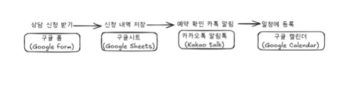
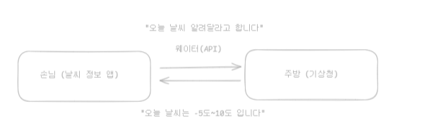
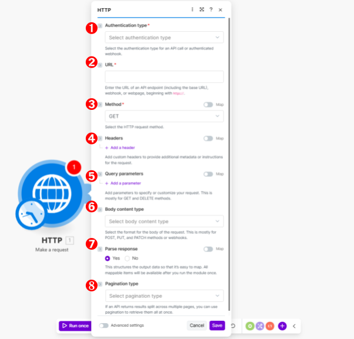
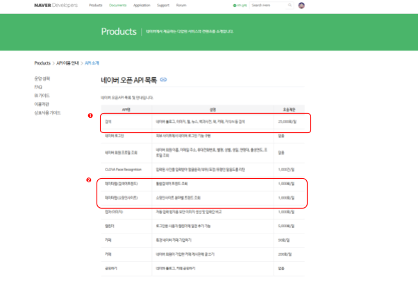
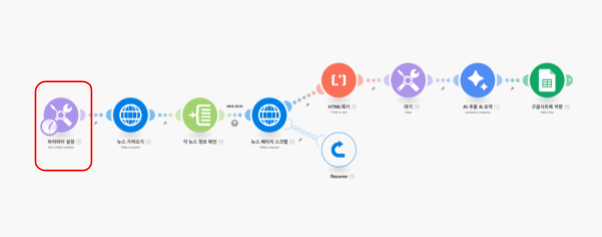
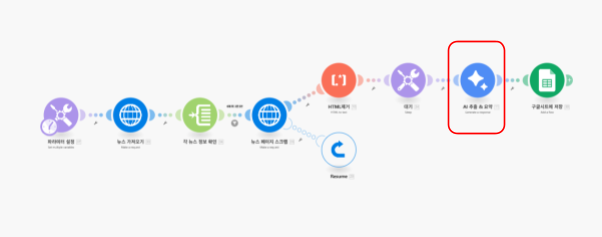
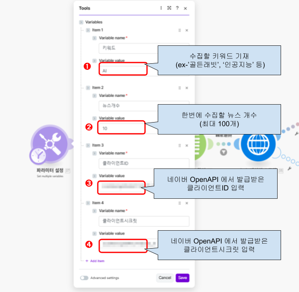
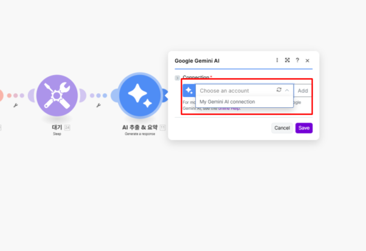

# 8차시: Make.com 기초 자동화 실습 & 네이버 뉴스 수집 자동화

## 15일차 | 2교시 (60분)

---

## 🎯 학습 목표

> 이 수업을 마치면 다음을 할 수 있음:
> 1. Make.com에서 폼 제출 → 메일 자동 답장 시나리오를 **직접 구축**할 수 있다
> 2. API의 개념을 이해하고, **네이버 OpenAPI 사용신청**을 할 수 있다
> 3. Make.com + 네이버 뉴스 API를 활용한 **뉴스 수집 자동화** 시나리오를 구현할 수 있다

---

## 📋 목차

| 시간 | 섹션 | 내용 |
|------|------|------|
| 5분 | 1. 도입 | 분양 기획자의 반복 업무, 왜 자동화가 필요한가? |
| 20분 | 2. [실습] 폼 → 메일 자동 답장 | Tally 폼 + Gmail 연동 시나리오 구축 |
| 5분 | 3. API 개념 이해 | API = 웨이터, HTTP 모듈 소개 |
| 5분 | 4. 네이버 OpenAPI 소개 | 네이버 개발자 센터 + 사용신청 |
| 20분 | 5. [실습] 네이버 뉴스 수집 자동화 | HTTP → 뉴스 API → AI 요약 → 구글시트/메일 |
| 5분 | 6. 정리 & 다음 차시 예고 | 핵심 요약, 다음 시간 안내 |

---

# 1. 📌 도입 — 분양 기획자에게 자동화가 필요한 순간 (5분)

## 이런 상황, 익숙하지 않은가?

```
팀장님: 챗대리, 오늘 분양 상담 신청 건들 다 확인하고 있지?
챗대리: 네, 꼼꼼히 확인하고 있습니다!
팀장님: 신청 들어오면 5분 내로 고객에게 접수 확인 메일 보내줘. 응대는 스피드가 생명이야.
챗대리: 넵! (하... 신청 들어올 때마다 하던 거 멈추고 복붙해야 하네..)
```

분양 기획자의 일상에는 **"반드시 해야 하지만, 깊은 생각이 필요하지 않은"** 반복 업무가 많음

- 상담 신청 접수 → 확인 메일 발송
- 경쟁 단지 뉴스 모니터링 → 취합 → 팀 공유
- 고객 문의 → 유형별 분류 → 담당자 배정
- 주간 분양률 데이터 → 보고서 작성

> 💡 이런 반복 업무를 **Make.com으로 자동화**하면, 본업인 **기획·전략 수립에 집중**할 수 있음

### ⚡ 1차시 복습: Make.com의 핵심 개념

| 개념 | 설명 | 비유 |
|------|------|------|
| **시나리오** | 자동화 워크플로우 전체 | 레시피 |
| **모듈** | 각 단계의 작업 단위 | 요리 과정 (썰기, 볶기...) |
| **커넥션** | 앱/서비스와의 연결 | 식재료 공급처 |
| **번들** | 모듈 간 전달되는 데이터 묶음 | 재료 바구니 |

> 이번 시간에는 실제로 시나리오를 **직접 만들어보는 실습** 시간!

---

# 2. 🖥️ [실습] 분양 상담 신청 → 자동 접수 확인 메일 발송 (20분)

## 만들 자동화 시나리오

분양 상담 신청 폼이 제출되면, **자동으로 접수 확인 메일**이 고객에게 발송되는 시나리오

```
[Tally 폼 제출] → [Gmail 자동 답장]
   고객이 상담 신청     →    "접수 완료" 메일 자동 발송
```


> 상담 신청 → 내역 저장 → 확인 알림 → 일정 등록까지, Make로 모두 자동화 가능

---

## Step 1: Tally 폼 만들기 (5분)

### Tally란?

간단한 온라인 폼(설문/신청서)을 만들 수 있는 무료 도구. Make.com과 연동이 쉬워 자동화 입문에 적합

- 🔗 [tally.so](https://tally.so) 접속 → 회원가입

### 분양 상담 신청서 폼 만들기

1. **New Form** 클릭 → 제목: `분양 상담 신청서`
2. 아래 필드를 추가

| 필드명 | 타입 | 설명 |
|--------|------|------|
| 성함 | Short Answer | 고객 이름 |
| 연락처 | Short Answer | 전화번호 |
| 이메일 | Email | 접수 확인 메일 발송용 |
| 관심 단지 | Multiple Choice | 예: A단지, B단지, C단지 |
| 문의 내용 | Long Answer | 상세 문의 |

3. **Publish** 클릭 → 폼 링크 생성 완료

> 💡 **Tally 외 대안**: Google Forms, Typeform 등도 Make와 연동 가능. 하지만 Tally는 **Webhook(즉시 트리거)**을 무료로 지원해 실시간 자동화에 유리

---

## Step 2: Make.com에서 시나리오 만들기 (10분)

### 2-1. Tally 트리거 모듈 추가

1. Make.com → **Scenarios** → **+ Create a new scenario**
2. **+** 클릭 → `Tally` 검색 → **Watch New Responses** 선택
3. **Create a webhook** 클릭 → 이름: `분양상담신청` → Form ID 선택
4. **Save** 클릭

> 📌 이 모듈은 **즉시 트리거(Instant Trigger)** 방식 — 폼 제출 즉시 시나리오가 실행됨 (⚡ 번개 아이콘 확인)

### 2-2. Gmail 발송 모듈 추가

1. Tally 모듈 옆 **+** 클릭 → `Email` 검색 → **Send an Email** 선택
2. **Create a connection** 클릭 → 이메일 연동 설정

#### 📧 Gmail 연동 설정 (SMTP)

| 항목 | 값 |
|------|-----|
| Connection type | Other |
| Email address | 본인 Gmail 주소 |
| SMTP Server | smtp.gmail.com |
| Port | 465 |
| Secure connection | Yes |
| Username | Gmail 주소 |
| Password | **앱 비밀번호** (2단계 인증 필요) |

> ⚠️ **Gmail 앱 비밀번호 발급 방법**
> Google 계정 → 보안 → 2단계 인증 활성화 → 앱 비밀번호 생성 → 16자리 복사

#### 네이버 메일 연동 시 설정

| 항목 | 값 |
|------|-----|
| SMTP Server | smtp.naver.com |
| Port | 465 |
| Username | 네이버 아이디 |
| Password | 네이버 비밀번호 |

> 네이버 메일 → 환경설정 → POP3/SMTP 설정 → SMTP 사용 **"사용함"** 체크 필요

### 2-3. 이메일 내용 설정

| 항목 | 설정값 |
|------|--------|
| **To** | Tally 모듈의 `이메일` 필드 (클릭해서 매핑) |
| **Subject** | `[OO건설] 분양 상담 신청이 접수되었습니다` |
| **Content** | 아래 참조 |

```
안녕하세요, {{성함}}님!

분양 상담 신청이 정상적으로 접수되었습니다.

▶ 관심 단지: {{관심 단지}}
▶ 접수 일시: {{현재 날짜/시간}}

담당자가 확인 후 영업일 기준 1일 내 연락드리겠습니다.
감사합니다.

OO건설 분양팀 드림
```

> 💡 `{{성함}}`, `{{관심 단지}}` 부분은 Make 편집 화면에서 Tally 모듈의 필드를 **클릭해서 매핑**하면 됨

---

## Step 3: 테스트 & 활성화 (5분)

### 테스트

1. 하단의 **Run once** 클릭 → 대기 상태 진입
2. Tally 폼으로 이동 → **테스트 데이터 입력** 후 제출
3. Make 화면에서 모듈 위의 **숫자 버블** 확인 → 클릭해서 결과 확인
4. 본인 메일함에서 **접수 확인 메일 도착 여부** 확인

### 활성화 (스케줄 설정)

- 하단의 토글을 **ON** → **Immediately as data arrives** 선택
- 이제 폼이 제출될 때마다 **자동으로 메일이 발송**됨

> 🎉 **축하!** 첫 번째 Make 자동화 시나리오 완성!

### 🔧 실무 확장 아이디어

이 시나리오를 확장하면 분양 현장에서 더 강력하게 활용 가능

| 확장 시나리오 | 추가 모듈 |
|--------------|-----------|
| 신청 내역을 구글시트에 자동 저장 | Google Sheets - Add a Row |
| 담당자에게 슬랙/카카오 알림 | Slack - Send a Message |
| 상담 일정을 구글 캘린더에 자동 등록 | Google Calendar - Create an Event |
| 고객 유형별 다른 메일 발송 (라우터 활용) | Router + Filter |

---

# 3. 📌 API 개념 이해 — Make의 숨은 무기 (5분)

## API = 레스토랑의 웨이터

앞의 실습에서는 Make에 **공식 연동된 앱**(Tally, Gmail)을 사용했음. 그런데 **네이버, 카카오** 같은 한국 서비스는 Make에 공식 앱이 없음

> ❓ "그러면 네이버 뉴스 수집은 불가능한 건가?"
> ✅ **아님!** API만 있으면 어떤 서비스든 연결 가능

### API란?

**A**pplication **P**rogramming **I**nterface — 서로 다른 서비스가 **소통하는 창구**



| 비유 | API 세계 |
|------|----------|
| 🧑 손님 (나) | 데이터를 요청하는 쪽 (Make) |
| 🍽️ 웨이터 | **API** (요청을 전달하고 결과를 가져옴) |
| 👨‍🍳 주방 | 데이터를 가지고 있는 서버 (네이버) |
| 📋 메뉴판 | API 문서 (어떤 요청이 가능한지 안내) |

### Make에서 API를 쓰는 방법: HTTP 모듈

Make에는 `HTTP - Make a request` 라는 **만능 모듈**이 있음. 이 모듈로 API 요청을 직접 보낼 수 있음



| 설정 항목 | 역할 | 비유 |
|-----------|------|------|
| **URL** | 어디에 요청할지 | 레스토랑 주소 |
| **Method** | 어떤 요청인지 (GET=조회, POST=생성) | 주문 종류 |
| **Headers** | 신분증 (API 키 등) | 예약자 이름 |
| **Query Parameters** | 세부 조건 (키워드, 개수 등) | 메뉴 선택 |

> 💡 **핵심**: Make 공식 앱 목록에 없는 서비스도, API가 있으면 HTTP 모듈로 연결 가능!

---

# 4. 📌 네이버 OpenAPI 소개 & 사용신청 (5분)

## 네이버 OpenAPI로 할 수 있는 것



| API | 설명 | 분양 기획 활용 예시 |
|-----|------|-------------------|
| **뉴스 검색** | 키워드로 네이버 뉴스 검색 | 경쟁 단지 뉴스 모니터링 |
| **블로그 검색** | 키워드로 블로그 글 검색 | 분양 후기·리뷰 수집 |
| **데이터랩** | 검색어 트렌드 분석 | "○○ 분양" 검색량 추이 파악 |
| **쇼핑 검색** | 쇼핑 상품 검색 | 인테리어 트렌드 조사 |

> 🔗 [네이버 개발자 센터](https://developers.naver.com/products/intro/plan/plan.md) — 무료! 하루 25,000건까지 호출 가능

## 🖥️ [시연] 네이버 OpenAPI 사용신청 방법

### Step 1: 네이버 개발자 센터 접속

1. 🔗 [developers.naver.com](https://developers.naver.com) 접속
2. 네이버 계정으로 로그인

### Step 2: 애플리케이션 등록

1. 상단 메뉴 **Application** → **애플리케이션 등록** 클릭
2. 설정값 입력:

| 항목 | 입력값 |
|------|--------|
| 애플리케이션 이름 | `make-뉴스자동화` (자유 입력) |
| 사용 API | **검색** 체크 |
| 환경 | **WEB 설정** → URL: `https://www.make.com` |

3. **등록하기** 클릭

### Step 3: Client ID & Secret 확인

- 등록 완료 후 **Client ID**와 **Client Secret**이 발급됨
- 이 두 값을 **메모장에 복사** → Make에서 사용할 예정

> ⚠️ Client Secret은 **비밀번호 역할** — 외부에 공유하면 안 됨!

---

# 5. 🖥️ [실습] 네이버 뉴스 수집 자동화 (20분)

## 만들 자동화 시나리오

매일 아침, 관심 키워드(분양, 재건축, 경쟁 단지명 등)에 관한 **최신 네이버 뉴스를 자동 수집**하여 정리하는 시나리오

```
[스케줄 트리거]     [네이버 뉴스 API]     [AI 요약]       [결과 전달]
  매일 오전 9시  →  키워드 뉴스 수집  →  핵심 내용 추출  →  메일/시트 저장
```



> 이 시나리오는 크게 4단계로 구성됨:
> 1. ➊ **뉴스 수집** — 네이버 오픈API로 키워드 뉴스 가져오기
> 2. ➋ **웹페이지 스크래핑** — 기사 본문 전체 가져오기
> 3. ➌ **AI 요약 & 저장** — Gemini AI로 핵심 추출 → 구글시트 정리
> 4. ➍ **알림 전송** — 정리된 뉴스를 메일/슬랙으로 자동 전송

---

## Step 1: 템플릿 가져오기 (블루프린트 임포트) (3분)

> 💡 복잡한 시나리오를 처음부터 만들 필요 없음! **블루프린트(Blueprint)** 파일을 임포트하면 시나리오 골격이 한 번에 생성됨

### 블루프린트 임포트 방법

1. Make.com → **Scenarios** → **+ Create a new scenario**
2. 우측 상단 **[...]** 클릭 → **Import Blueprint** 선택
3. 제공된 Blueprint JSON 파일 업로드 → **Save**



> 템플릿이 로드되면 위와 같이 시나리오 모듈들이 자동 배치됨. 이제 3가지 설정만 추가하면 완성!

---

## Step 2: 네이버 뉴스 API 파라미터 설정 (5분)

첫 번째 모듈 `파라미터 설정`을 클릭 → 아래 값을 입력



| 항목 | 설정값 | 설명 |
|------|--------|------|
| **키워드** | `분양` (원하는 키워드로 변경) | 수집할 뉴스 키워드 |
| **뉴스개수** | `10` | 한 번에 수집할 기사 수 (최대 100) |
| **클라이언트ID** | 아까 발급받은 Client ID | 네이버 API 인증용 |
| **클라이언트시크릿** | 아까 발급받은 Client Secret | 네이버 API 인증용 |

> 💡 **분양 기획자를 위한 추천 키워드 예시**
> - `"분양"`, `"재건축"`, `"리모델링"`, `"분양가상한제"`
> - 경쟁 단지명: `"○○ 자이"`, `"○○ 힐스테이트"` 등

---

## Step 3: Gemini AI 연결 (5분)

`AI 추출 & 요약` 모듈 클릭 → **Connection** 설정

### Gemini API 키 발급 방법

1. 🔗 [Google AI Studio](https://aistudio.google.com) 접속
2. 좌측 메뉴 **API 키** → **API 키 만들기** 클릭
3. 생성된 API 키 복사

### Make에서 연결

1. `AI 추출 & 요약` 모듈 → **Connection** → **Add**
2. API 키 붙여넣기 → **Save**



> 💡 Gemini AI는 무료 사용량이 넉넉해 학습/테스트에 최적. 뉴스 본문에서 **핵심 내용만 추출**하고 **3줄 요약**을 자동 생성해줌

---

## Step 4: 구글시트 연결 & 테스트 (5분)

### 구글시트 연결

1. `구글 시트 저장` 모듈 클릭 → **Connection** → 구글 계정 연결
2. 저장할 스프레드시트와 시트 선택 (미리 빈 시트 준비)

### 테스트 실행

1. 하단 **Run once** 클릭
2. 각 모듈 실행 결과 확인 (모듈 위 숫자 버블 클릭)
3. 구글시트에 뉴스 데이터가 정리되었는지 확인

### 구글시트 결과 예시

| 날짜 | 제목 | 요약 | 원문 링크 |
|------|------|------|----------|
| 2026-03-19 | "○○지구 분양 일정 확정" | 3월 말 분양 예정, 총 1,200세대... | https://... |
| 2026-03-19 | "재건축 규제 완화 법안 통과" | 안전진단 기준 완화, 서울 주요 단지... | https://... |

---

## Step 5: 스케줄 설정 (2분)

1. 하단의 시계 아이콘 클릭
2. **Every day** → 시간: **오전 9:00** 설정
3. **Save** → 시나리오 활성화 (**ON**)

> 🎉 이제 **매일 아침 9시**, 설정한 키워드의 최신 뉴스가 자동으로 수집·요약되어 구글시트에 정리됨!

### 🔧 추가 확장: 메일/슬랙으로 알림 보내기

구글시트 저장 뒤에 모듈을 추가하면 팀원들에게 자동 공유 가능

| 확장 | 추가 모듈 | 효과 |
|------|-----------|------|
| 이메일 전송 | Gmail - Send an Email | 팀장님께 뉴스 요약 메일 자동 발송 |
| 슬랙 전송 | Slack - Send a Message | 팀 채널에 실시간 뉴스 공유 |
| 텍스트 합치기 | Text Aggregator | 여러 뉴스를 하나의 메일로 묶어서 발송 |

> 💡 뉴스가 여러 건일 때 **메일이 건별로 따로 오는 문제**가 발생할 수 있음
> → **Text Aggregator** 모듈을 이메일 앞에 추가하면 여러 뉴스를 하나로 묶어서 발송 가능 (1차시의 RSS 뉴스 자동화에서 배운 것과 동일한 원리!)

---

# 6. 📌 정리 & 다음 차시 예고 (5분)

## ✅ 오늘 배운 핵심

| 항목 | 내용 |
|------|------|
| **실습 1** | Tally 폼 → Gmail 자동 답장 시나리오 구축 |
| **API 개념** | API = 서비스 간 소통 창구, HTTP 모듈로 Make에서 활용 |
| **네이버 OpenAPI** | 개발자 센터에서 무료 발급, 뉴스/블로그/트렌드 검색 가능 |
| **실습 2** | 네이버 뉴스 API + Gemini AI → 자동 수집·요약·저장 |

## 💡 분양 기획 실무 활용 아이디어

| 자동화 시나리오 | 활용 상황 |
|----------------|-----------|
| 경쟁 단지 뉴스 모니터링 | 매일 아침 경쟁사 분양 관련 뉴스 자동 취합 |
| 분양 상담 접수 자동화 | 고객 문의 즉시 접수 확인 + 담당자 알림 |
| 블로그 상위 노출 추적 | 우리 단지 블로그 마케팅 성과 자동 모니터링 |
| 분양가 트렌드 분석 | 데이터랩 API로 검색량 변화 추적 |

## 📢 다음 차시 예고

> **3교시: Make.com 이미지 생성 자동화 & 경쟁사 데이터 수집**
> - Make.com에서 AI 이미지 생성 자동화하기
> - Apify를 활용한 경쟁사 데이터 대량 수집
> - MCP 자동화와의 비교 (대량 수집 vs 소량 집계)

---

## 📎 출처 참조

### 내부 문서
- [[002.강의자료/250601_인프런_사례로-배우는-MAKE의-모든-것/대본/07.make첫시나리오만들기]] — Make 첫 시나리오 만들기 (RSS+이메일)
- [[002.강의자료/250601_인프런_사례로-배우는-MAKE의-모든-것/대본/견적서발송자동화]] — 폼 → 견적서 → 메일 자동 발송
- [[002.강의자료/260116_인프런_교강사/10차시 Make.com 기초 (모듈 & 로직) 31077034908f805f8e4fc411258d0fae]] — Make 모듈/로직 개념
- [[006.도서집필/001.이게되네/완성원고/[이게 되네_ PART 00] Make 이해하기_16]] — Make란 무엇인가
- [[006.도서집필/001.이게되네/완성원고/[이게 되네_ PART 04] 데이터 수집 및 보고서 자동화하기 - Chapter 12,13,14,15,16,17_125]] — API 개념, 네이버 OpenAPI, 뉴스 수집 자동화

### 외부 출처
- [Make.com 공식 사이트](https://www.make.com)
- [Tally.so - 무료 온라인 폼 빌더](https://tally.so)
- [네이버 개발자 센터 - 오픈 API 목록](https://developers.naver.com/products/intro/plan/plan.md)
- [Google AI Studio - Gemini API 키 발급](https://aistudio.google.com)
- [네이버 OpenAPI 가이드](https://developers.naver.com/docs/common/openapiguide/)
