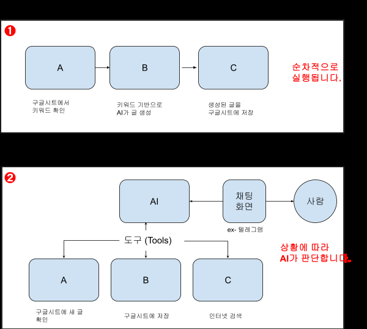

# 12차시: Make.com 시나리오를 도구로 활용하는 AI 에이전트 구축

## 15일차 | 6교시 (60분)

---

## 🎯 학습 목표

> 이 수업을 마치면 다음을 할 수 있음:
> 1. Make.com 시나리오를 **MCP 도구로 등록**하여 AI에서 직접 호출할 수 있음
> 2. Make.com으로 **회사메일 연동 → 자동 답장** 시나리오를 구축할 수 있음
> 3. Make.com으로 **카드뉴스용 AI 이미지 생성** 시나리오를 구축할 수 있음
> 4. 여러 MCP 도구를 조합하여 **복합 업무 자동화**를 설계할 수 있음

---

## 📋 목차

| 시간 | 섹션 | 내용 |
|------|------|------|
| 3분 | 1. 도입 | 4~5차시 복습 & AI 에이전트 개념 |
| 12분 | 2. Make.com 시나리오 → MCP 도구 등록 | MCP 개념, API 토큰 발급, 클로드 연결 |
| 15분 | 3. [실습] 회사메일 연동 답장 시나리오 | Gmail 모듈 활용 자동 답장 구축 |
| 15분 | 4. [실습] 카드뉴스 AI 이미지 생성 | DALL-E + Make.com 이미지 생성 자동화 |
| 10분 | 5. 여러 MCP 조합 활용 아이디어 | 분양 마케팅 실전 활용 시나리오 |
| 5분 | 6. 정리 & 다음 차시 예고 | 핵심 요약 + 16일차 안내 |

---

# 1. 📌 도입 — 시나리오를 AI 도구로 만든다? (3분)

## 4~5차시 복습

이전 시간에 Make.com으로 **기초 자동화**(폼 → 메일 전송)와 **네이버 뉴스 수집**, **이미지 생성**, **경쟁사 데이터 수집**을 구현함

그런데 이런 시나리오를 실행하려면 매번 **Make.com 대시보드에 직접 접속**해서 버튼을 눌러야 했음

```
"Make에 로그인 → 시나리오 찾기 → 실행 버튼 클릭"
...이걸 매번 반복해야 하나?
```

→ 이번 시간에는 Make 시나리오를 **AI의 도구(Tool)로 등록**해서, **대화만으로 시나리오를 실행**하는 방법을 배움

## ⚡ 자동화 워크플로 vs AI 에이전트



| | 자동화 워크플로 (시나리오) | AI 에이전트 |
|---|---|---|
| **작동 원리** | 미리 정의된 순서대로 실행 (A→B→C) | 목표를 주면 **AI가 스스로 판단**하여 도구 선택 |
| **유연성** | 고정된 프로세스, 변화에 취약 | 상황에 맞게 적응 |
| **예측 가능성** | 매우 높음 (결과가 일정) | 상대적으로 낮음 (확률적 결과) |
| **비용** | 실행 비용 낮음 | LLM 호출당 비용 발생 |
| **적합한 상황** | 반복적, 정형화된 업무 | 맥락 판단이 필요한 복잡한 업무 |

> 💡 **핵심**: 이번 시간에는 Make 시나리오(워크플로)를 AI 에이전트의 **도구**로 등록하여, **두 가지 장점을 결합**함. AI가 상황을 판단하고, 필요할 때 Make 시나리오를 자동 실행하는 구조

---

# 2. 🔗 Make.com 시나리오 → MCP 도구로 등록하기 (12분)

## 2-1. MCP란? — AI에게 도구를 쥐어주는 방법

**MCP(Model Context Protocol)** = AI 모델이 외부 도구나 데이터에 접근할 수 있게 해주는 **개방형 표준**

쉽게 비유하면:

```
USB 포트 하나면 → 마우스, 키보드, 외장하드 모두 연결 가능
MCP 하나면 → 노션, 구글 캘린더, Make.com 시나리오 모두 AI에서 호출 가능
```

### Make AI 에이전트 vs MCP

| | Make AI 에이전트 | MCP 연결 |
|---|---|---|
| **실행 환경** | Make 안의 채팅/슬랙에서만 | 클로드 데스크탑 등 **어디서든** |
| **호출 방식** | Make 대시보드에서 직접 | AI와 **대화하면서 자연어로** |
| **조합 범위** | Make 시나리오끼리만 | 다른 MCP(노션, 캘린더 등)와 **자유 조합** |

> 💡 MCP를 연결하면, Make에서 만든 시나리오가 AI의 **"도구 상자"**에 들어감. AI가 "이메일 보내야겠네?" → Make의 이메일 시나리오를 **알아서 실행**

## 2-2. Make MCP 서버 구성 요소

| 구성 요소 | 역할 | 예시 |
|-----------|------|------|
| **MCP Server** | AI와 Make 사이의 통신 채널 | `us1.make.com/mcp/MCP_U.../stateless` |
| **Tool (시나리오)** | 실행할 자동화 워크플로 | "이메일 보내기", "이미지 생성" |
| **On Demand Webhook** | 시나리오 시작점 (트리거) | AI가 호출하면 시나리오 실행 |
| **Parameters** | AI가 전달할 입력값 | 이메일 주소, 제목, 본문 |
| **Webhook Response** | 시나리오 실행 결과 반환 | "이메일 전송 완료" |

## 2-3. 🖥️ [시연] 클로드 데스크탑에 Make MCP 연결하기

### STEP 1: Make에서 API 토큰 발급

1. [Make.com](https://www.make.com) 로그인
2. 좌측 하단 **프로필 아이콘** → **Profile** 클릭
3. **API Access** 탭 → **+ Add token** 클릭
4. Scope에서 **Select All** → Label 입력 → **Save**
5. 생성된 API 토큰을 **복사**해서 메모장에 보관

> ⚠️ API 토큰은 Make 계정에 대한 접근 권한을 부여하는 열쇠임. **절대 외부에 공개하지 말 것**

### STEP 2: MCP URL 구성

메모장에 복사한 토큰으로 아래 형식의 URL을 구성함:

```
https://[존].make.com/mcp/MCP_U[토큰]/stateless
```

| 부분 | 설명 | 확인 방법 |
|------|------|-----------|
| `[존]` | Make 계정 주소 앞부분 | 브라우저 주소창에서 확인 (us1, eu1 등) |
| `[토큰]` | 방금 발급받은 API 토큰 | 메모장에 복사해둔 값 |

완성 예시:
```
https://us1.make.com/mcp/MCP_Uabc123def456/stateless
```

### STEP 3: 클로드 데스크탑에 커넥터 등록

1. 클로드 데스크탑 앱 실행 → **Settings(설정)**
2. **커넥터(Connectors)** → **커스텀 커넥터 추가** 클릭
3. URL 입력란에 MCP URL 붙여넣기 → 이름: `Make MCP` → **추가**
4. 클로드 데스크탑 **완전 종료 후 재시작**
5. 대화창 옆 **+** 버튼 → 커넥터 목록에서 Make MCP 확인

### STEP 4: 연결 테스트

대화창에 테스트 프롬프트 입력:
```
Make MCP의 시나리오 목록을 보여줘
```

→ 권한 허용 팝업이 나타나면 **"항상 허용"** 클릭

> 💡 이 과정을 한 번만 완료하면, 이후에는 Make에 시나리오를 추가할 때마다 **클로드에서 자동으로 새 도구가 인식**됨

---

# 3. 📧 [실습] 회사메일 연동 자동 답장 시나리오 (15분)

## 3-1. 완성 시나리오 구조

```
[On Demand Webhook] → [Gmail: Send an Email] → [Webhook Response]
```

AI에게 "이 내용으로 고객에게 메일 보내줘"라고 말하면, Make의 Gmail 시나리오가 실행되어 **자동으로 이메일을 발송**하는 구조

### 분양 기획 업무에서의 활용 예시

| 상황 | AI에게 하는 말 | 결과 |
|------|---------------|------|
| 고객 문의 답변 | "김철수 고객에게 분양 일정 안내 메일 보내줘" | Gmail로 자동 발송 |
| 내부 보고 | "이번 주 분양률 현황을 팀장님에게 메일로 보내줘" | 보고 메일 자동 작성·발송 |
| 협력사 연락 | "시공사에 일정 변경 안내 메일 보내줘" | 비즈니스 메일 자동 발송 |

## 3-2. 🖥️ [시연] 시나리오 만들기 — 단계별

### STEP 1: 새 시나리오 생성

1. Make.com 로그인 → **Create a new scenario** 클릭
2. 시나리오 이름을 **영어**로 설정: `send_email_reply`

> ⚠️ MCP로 호출하려면 시나리오 이름이 반드시 **영어**여야 함

### STEP 2: On Demand Webhook 모듈 추가

1. 첫 번째 모듈: **Webhooks** → **Custom webhook** 선택
2. Webhook name: `email_sender`
3. **Create** 클릭

### STEP 3: Gmail 모듈 추가

1. + 버튼으로 다음 모듈 추가: **Gmail** → **Send an Email**
2. Gmail 계정 연결 (구글 로그인)
3. 필드 매핑:

| 필드 | 설정값 |
|------|--------|
| **To** | Webhook에서 받은 `to_email` 값 |
| **Subject** | Webhook에서 받은 `subject` 값 |
| **Content** | Webhook에서 받은 `body` 값 |

### STEP 4: Webhook Response 모듈 추가

1. + 버튼 → **Webhooks** → **Webhook response**
2. Body에 결과 메시지 입력: `이메일이 성공적으로 전송되었습니다.`

### STEP 5: Input/Output 설정 & 활성화

1. 시나리오 설정에서 **Input** 정의:
   - `to_email` (문자열) — 수신자 이메일
   - `subject` (문자열) — 메일 제목
   - `body` (문자열) — 메일 본문
2. **Output** 정의:
   - `result` (문자열) — 전송 결과
3. **Activate(활성화)** 토글 켜기

### STEP 6: 클로드에서 호출 테스트

```
send_email_reply로 다음 내용의 메일을 보내줘:
- 받는 사람: test@example.com
- 제목: [OO파크] 분양 상담 일정 안내
- 본문: 안녕하세요. 요청하신 분양 상담 일정을 안내드립니다.
  이번 주 토요일 오후 2시에 모델하우스에서 뵙겠습니다.
```

> 💡 AI가 프롬프트의 맥락을 이해하기 때문에, "고객에게 분양 상담 일정 알려줘"처럼 **자연스럽게 말해도** AI가 적절한 메일 내용을 구성해서 시나리오를 호출함

---

# 4. 🎨 [실습] 카드뉴스 AI 이미지 생성 시나리오 (15분)

## 4-1. 왜 이미지 생성을 자동화해야 할까?

분양 마케팅에서 이미지는 **가장 많이, 가장 자주** 필요한 콘텐츠임:

| 용도 | 필요 빈도 | 기존 방식 |
|------|----------|----------|
| SNS 홍보 이미지 | 매일 1~3장 | 디자이너에게 의뢰 (1~2일 소요) |
| 카드뉴스 | 주 2~3회 | 파워포인트로 직접 제작 (2~3시간) |
| 배너/썸네일 | 이벤트마다 | 외주 (비용 발생) |
| 현장 안내 이미지 | 수시 | 기존 템플릿 수정 |

> 💡 AI 이미지 생성을 자동화하면, **프롬프트 하나로 수분 내에** 마케팅용 이미지를 만들 수 있음

## 4-2. 완성 시나리오 구조

```
[On Demand Webhook] → [OpenAI: Create an Image (DALL-E 3)] → [Webhook Response]
```

## 4-3. 🖥️ [시연] 시나리오 만들기 — 단계별

### STEP 1: 새 시나리오 생성

1. **Create a new scenario** → 이름: `generate_card_news_image`

### STEP 2: On Demand Webhook 모듈

1. **Webhooks** → **Custom webhook** → 이름: `image_generator`
2. **Create** 클릭

### STEP 3: OpenAI 이미지 생성 모듈

1. + 버튼 → **OpenAI** → **Create an Image** 선택
2. OpenAI 계정 연결 (API Key 입력)
3. 필드 설정:

| 필드 | 설정값 |
|------|--------|
| **Model** | `dall-e-3` |
| **Prompt** | Webhook에서 받은 `image_prompt` 값 |
| **Size** | `1024x1024` (카드뉴스 정사각형) |
| **Quality** | `standard` |

### STEP 4: Webhook Response 모듈

1. + 버튼 → **Webhooks** → **Webhook response**
2. Body에 **생성된 이미지 URL** 매핑

### STEP 5: Input/Output 설정 & 활성화

1. **Input**: `image_prompt` (문자열) — 이미지 생성 프롬프트
2. **Output**: `image_url` (문자열) — 생성된 이미지 URL
3. **Activate** 토글 켜기

### STEP 6: 클로드에서 호출 테스트

```
generate_card_news_image로 다음 이미지를 만들어줘:
"한강 뷰 아파트 분양 홍보 카드뉴스. 밝고 깨끗한 톤,
한강이 보이는 거실 전경, 하단에 '2026년 입주 예정' 텍스트 공간"
```

## 4-4. 💡 대량 이미지 생성: Google Sheets 연동

한 장씩 만드는 것을 넘어, **구글 시트에 프롬프트 목록을 작성하면 한꺼번에 이미지를 생성**하는 고급 시나리오도 가능함

```
[Schedule] → [Google Sheets: Search Rows] → [Iterator] → [OpenAI: Create Image] → [Google Sheets: Update Row]
```

| 구글 시트 컬럼 | 내용 |
|---------------|------|
| A열: 카드뉴스 주제 | "한강뷰 리빙", "커뮤니티 시설", "학군 안내" 등 |
| B열: 이미지 프롬프트 | 각 주제별 상세 프롬프트 |
| C열: 생성된 이미지 URL | 시나리오 실행 후 자동 입력 |

> 💡 이 방식으로 하면 **10장, 20장의 카드뉴스 이미지를 한 번에** 생성 가능

---

# 5. 🚀 여러 MCP 조합 활용 아이디어 (10분)

## MCP의 진짜 힘 = 하나의 프롬프트로 여러 도구를 동시 호출

Make MCP 외에도 클로드 데스크탑에는 **노션 MCP, 구글 캘린더 MCP, 구글 드라이브 MCP** 등 다양한 MCP를 연결할 수 있음. 이것들을 조합하면 **한 번의 프롬프트로 복잡한 업무를 한꺼번에** 처리 가능

## 분양 마케팅 실전 활용 시나리오

### 📌 시나리오 1: 경쟁 단지 분석 + 리포트 + 메일 발송

```
"OO지역 경쟁 단지 분양가를 조사해서 비교표로 정리하고,
팀장님에게 메일로 보내줘"
```

→ AI 동작 순서:
1. **Perplexity MCP**로 경쟁 단지 분양가 웹서치
2. **클로드**가 비교표로 정리
3. **Make의 send_email_reply** 시나리오로 메일 발송

### 📌 시나리오 2: SNS 콘텐츠 기획 + 이미지 생성 + 발행

```
"이번 주 분양 홍보 인스타그램 게시물 3개를 기획하고,
각각 카드뉴스 이미지까지 만들어줘"
```

→ AI 동작 순서:
1. **클로드**가 3개 게시물 기획 (카피 + 해시태그)
2. **Make의 generate_card_news_image**로 각각 이미지 생성
3. 결과물을 한 번에 정리하여 제공

### 📌 시나리오 3: 고객 문의 → 정보 조사 → 맞춤 답변 메일

```
"김철수 고객이 학군에 대해 문의했어.
이 지역 학군 정보를 조사해서 답변 메일을 보내줘"
```

→ AI 동작 순서:
1. **Perplexity MCP**로 해당 지역 학군 정보 조사
2. **클로드**가 고객 맞춤 답변 작성
3. **Make의 send_email_reply**로 메일 발송

### 📌 시나리오 4: 노션 데이터 → 보고서 작성 → 메일 발송

```
"노션에 정리된 이번 달 분양 실적 데이터를 가져와서
월간 보고서로 정리하고 팀장님에게 메일 보내줘"
```

→ AI 동작 순서:
1. **노션 MCP**로 분양 실적 데이터 조회
2. **클로드**가 월간 보고서 형태로 정리
3. **Make의 send_email_reply**로 메일 발송

## Make 시나리오 = AI의 도구가 하나씩 늘어나는 것

> 💡 **핵심**: Make에 시나리오를 하나 만들어 둘 때마다, 클로드가 쓸 수 있는 도구가 **하나씩 늘어남**. 이전 차시에서 만든 뉴스 수집, 이미지 생성, 데이터 수집 시나리오까지 모두 AI의 도구로 활용 가능

---

# 6. 📝 정리 & 다음 차시 예고 (5분)

## ✅ 핵심 요약

| 항목 | 내용 |
|------|------|
| **MCP** | AI가 외부 도구를 호출하는 표준 프로토콜. "AI의 USB 포트" |
| **Make MCP 연결** | API 토큰 발급 → URL 구성 → 클로드 커넥터 등록 (3단계) |
| **이메일 자동화** | On Demand Webhook → Gmail → Response 구조로 AI가 메일 발송 |
| **이미지 생성** | On Demand Webhook → DALL-E 3 → Response 구조로 카드뉴스 생성 |
| **MCP 조합** | 여러 MCP를 연결하면 한 프롬프트로 복합 업무 자동화 가능 |

## 📋 MCP 시나리오 활용을 위한 체크리스트

| 항목 | 확인 |
|------|------|
| 시나리오 이름이 **영어**로 되어 있는가 | ✅ |
| 트리거가 **On Demand**로 설정되어 있는가 | ✅ |
| 시나리오 **Input/Output**이 설정되어 있는가 | ✅ |
| 시나리오가 **Activate(활성화)** 상태인가 | ✅ |
| Make 프로필에서 **API 토큰**을 발급받았는가 | ✅ |
| MCP URL을 **올바른 형식**으로 구성했는가 | ✅ |
| 클로드 데스크탑에 **커넥터로 추가**했는가 | ✅ |
| 클로드 데스크탑을 **재시작**했는가 | ✅ |

## 🔮 다음 차시 예고 (16일차)

다음 시간부터는 **클로드 Cowork와 Skills**를 활용한 업무 자동화를 배움

- 클로드 Cowork로 **폴더 정리, 예약 작업** 등 기초 자동화
- 클로드 Skills로 **나만의 문서/PPT 제작** 자동화
- Skills + MCP를 결합한 **콘텐츠 제작 파이프라인** 구축

> 💡 오늘 배운 Make MCP가 16일차 Skills와 결합되면, **더 강력한 자동화 워크플로**를 만들 수 있음

---

## 📎 출처 참조

### 내부 문서
- [[006.도서집필/001.이게되네/완성원고/부록02_클로드앱에서 MCP로 Make시나리오 불러쓰기_11]] — Make MCP 연결 가이드
- [[006.도서집필/001.이게되네/완성원고/[이게 되네_ PART 05] AI 에이전트로 콘텐츠 생성 자동화하기 _93]] — AI 에이전트 개념 및 Make AI 에이전트
- [[002.강의자료/260116_인프런_교강사/14차시 노코드 자동화 + MCP 연계 활용 31177034908f806baba3ca798409ad89]] — MCP 연계 활용 강의자료

### 외부 출처
- [Make.com 공식 사이트](https://www.make.com)
- [Make MCP 도움말](https://www.make.com/en/help/tools/mcp)
- [클로드 데스크탑 다운로드](https://claude.com/download)
- [OpenAI DALL-E API 문서](https://platform.openai.com/docs/guides/images)
- [MCP 공식 사이트 (Anthropic)](https://modelcontextprotocol.io/)
